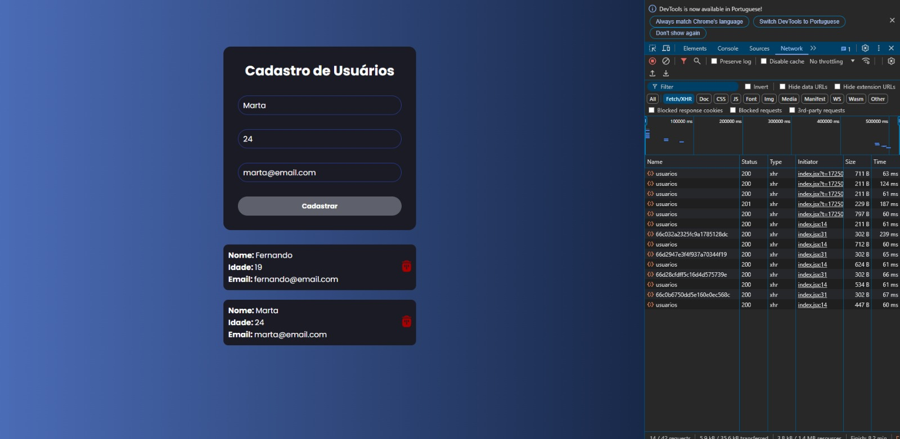
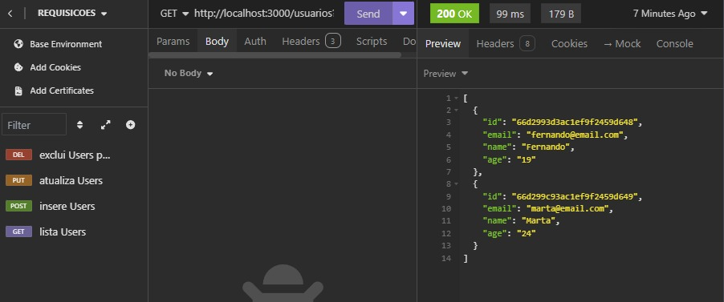

# Sistema de Cadastro de Usuário

## Visão Geral

Este projeto é um sistema de cadastro de usuários que inclui tanto front-end quanto back-end. Ele permite que os usuários criem e gerenciem contas de forma segura. O sistema foi desenvolvido utilizando tecnologias no qual estou utilizando atualmente e fiz o projeto para consolidar meus conhecimentos.

## Funcionalidades

- **Cadastro de Usuário:** Permite que novos usuários se registrem com suas informações.
- **Integração com Banco de Dados:** Armazenamento das informações dos usuários em um banco de dados MongoDB.

## Principais Tecnologias Utilizadas

- **React**
- **Node.js**
- **Express**
- **MongoDB**
- **Insomnia**

## Demonstração

## Contato

jpmdrsdev@gmail.com